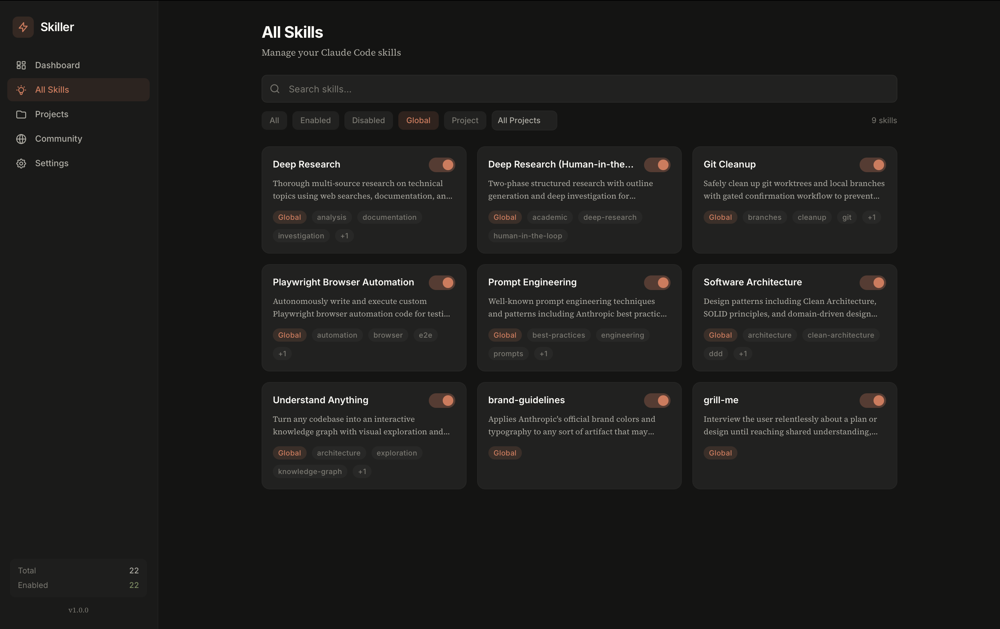
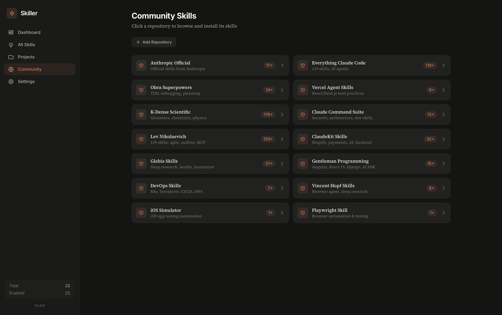

<p align="center">
  
</p>

<h1 align="center">Skiller</h1>

<p align="center">
  <strong>A desktop skill manager for Claude Code</strong>
</p>

<p align="center">
  <a href="#features">Features</a> &bull;
  <a href="#installation">Installation</a> &bull;
  <a href="#how-it-works">How It Works</a> &bull;
  <a href="#community-skills">Community Skills</a> &bull;
  <a href="#development">Development</a> &bull;
  <a href="#architecture">Architecture</a>
</p>

<p align="center">
  
  
  
  
</p>

---

Claude Code skills are powerful but hard to manage. They live as scattered `SKILL.md` files across directories with no UI, no search, no way to enable/disable without editing files, and no central place to discover new ones.

**Skiller fixes all of that.** A native macOS desktop app that gives you a dashboard to manage, discover, and install Claude Code skills — like VS Code extensions, but for Claude.

<p align="center">
  
</p>
<p align="center">
  
</p>

## Features

**Skill Management**
- Toggle skills on/off with a single click
- Search and filter across all your skills
- View SKILL.md content and frontmatter metadata
- Tag skills for organization
- Support for both global (`~/.claude/skills/`) and project-level skills

**Community Skills**
- Browse 14 curated GitHub repositories with hundreds of skills
- Click any repo to see its skills, one-click install
- Add your own GitHub repos as skill sources
- Covers: security (Trail of Bits), productivity (Obra), React (Vercel), DevOps, AI research, and more

**Project Support**
- Register project directories to manage project-level skills
- Project skills shown alongside global skills with scope badges

**Settings**
- GitHub personal access token support (5,000 API requests/hour vs 60 unauthenticated)
- Token stored locally at `~/.skiller/github_token`

## Installation

### Download

Grab the latest `.dmg` from [Releases](https://github.com/mashrikt/skiller/releases), open it, and drag Skiller to Applications.

### Build from Source

**Prerequisites:** Rust 1.94+, Node.js 18+, npm

```bash
git clone https://github.com/mashrikt/skiller.git
cd skiller
npm install
npm run tauri build
```

The built app will be at `src-tauri/target/release/bundle/macos/Skiller.app`.

### Development

```bash
npm run tauri dev
```

Opens the app with hot reload. Frontend at `http://localhost:1420`, Rust backend recompiles on save.

## How It Works

Skiller manages skills by **moving files between two directories**:

```
Enable:  ~/.skiller/vault/my-skill/  →  ~/.claude/skills/my-skill/
Disable: ~/.claude/skills/my-skill/  →  ~/.skiller/vault/my-skill/
```

Claude Code only discovers skills in `~/.claude/skills/`. By moving a skill to the vault, it becomes invisible to Claude — instant disable without deleting anything.

**State tracking** is handled by a lightweight SQLite database at `~/.skiller/skiller.db` that stores:
- Skill metadata (name, description, scope, enabled state)
- Tags you've added
- Registered projects
- Custom community repo sources

**The filesystem is the source of truth.** Every app launch runs a sync that scans both directories and reconciles with the database. If you manually move files around, Skiller catches up on next launch.

## Community Skills

Skiller comes with 14 audited community repositories (every one verified to contain valid SKILL.md files):

| Repository | Author | Focus |
|------------|--------|-------|
| [anthropics/skills](https://github.com/anthropics/skills) | Anthropic | Official skills (docs, MCP, testing, design) |
| [obra/superpowers](https://github.com/obra/superpowers) | Jesse Vincent | TDD, debugging, planning, git worktrees |
| [vercel-labs/agent-skills](https://github.com/vercel-labs/agent-skills) | Vercel | React/Next.js best practices |
| [K-Dense-AI/claude-scientific-skills](https://github.com/K-Dense-AI/claude-scientific-skills) | K-Dense AI | 178 scientific skills |
| [affaan-m/everything-claude-code](https://github.com/affaan-m/everything-claude-code) | affaan-m | 119 skills, 28 agents |
| [levnikolaevich/claude-code-skills](https://github.com/levnikolaevich/claude-code-skills) | Lev Nikolaevich | 129 skills catalog |
| [mrgoonie/claudekit-skills](https://github.com/mrgoonie/claudekit-skills) | ClaudeKit | 32 skills (backend, AI, Shopify) |
| [glebis/claude-skills](https://github.com/glebis/claude-skills) | Glebis | 37 skills (agency, automation) |

...and 6 more. You can also add any public GitHub repo that contains Claude Code skills.

### Adding Your Own Repo

1. Go to **Community** in the sidebar
2. Click **Add Repository**
3. Enter `owner / repo / skills-path` (e.g., `myorg / my-skills / skills`)
4. Your repo appears in the list and its skills are fetchable

### GitHub Rate Limits

Without a token: **60 requests/hour** (each repo click = 1 request).

With a token: **5,000 requests/hour**.

Go to **Settings** → paste a [personal access token](https://github.com/settings/tokens/new) with **no scopes required** (we only read public repos).

## Architecture

```
skiller/
├── src-tauri/                  # Rust backend
│   ├── src/
│   │   ├── lib.rs              # App entry, Tauri setup
│   │   ├── models.rs           # Skill, Project, AppState structs
│   │   ├── db.rs               # SQLite CRUD operations
│   │   ├── skills.rs           # Skill discovery, enable/disable, sync engine
│   │   ├── community.rs        # GitHub API fetching, community repos
│   │   └── commands.rs         # Tauri command handlers (IPC bridge)
│   ├── tests/
│   │   └── integration_tests.rs # 49 tests
│   └── Cargo.toml
├── src/                        # React frontend
│   ├── App.tsx                 # Main layout + routing
│   ├── api.ts                  # Tauri invoke wrappers
│   ├── types.ts                # TypeScript type definitions
│   ├── hooks/useSkills.ts      # Central state management hook
│   └── components/
│       ├── Dashboard.tsx        # Stats, quick actions, recent skills
│       ├── SkillList.tsx        # Filterable skill grid
│       ├── SkillCard.tsx        # Individual skill card with toggle
│       ├── SkillDetail.tsx      # Full skill view with tags, content
│       ├── ProjectManager.tsx   # Add/remove project directories
│       ├── CommunityBrowser.tsx # Browse & install from GitHub repos
│       ├── Settings.tsx         # GitHub token configuration
│       ├── Sidebar.tsx          # Navigation
│       └── SearchBar.tsx        # Debounced search input
├── bundled-skills/
│   └── manifest.json           # 100 curated skill definitions
└── docs/
    └── screenshots/            # App screenshots
```

### Tech Stack

| Layer | Technology |
|-------|-----------|
| Runtime | [Tauri 2](https://tauri.app) (Rust + WebView) |
| Backend | Rust, SQLite ([rusqlite](https://crates.io/crates/rusqlite)), [reqwest](https://crates.io/crates/reqwest) |
| Frontend | React 18, TypeScript, [Tailwind CSS](https://tailwindcss.com) |
| Build | Vite, Cargo |
| Binary size | ~10 MB |
| DMG size | ~4 MB |

### Key Design Decisions

- **File-move based enable/disable** — No config files to edit, no frontmatter to modify. Moving the directory is atomic and reversible.
- **Deterministic UUIDs** — Skill IDs are generated from file paths using UUIDv5, so re-scanning always finds the same skill.
- **Filesystem as source of truth** — The DB is a cache/index. Delete it and Skiller rebuilds from disk on next launch.
- **No bundled Node.js** — Tauri uses the system WebView. The final binary has zero JavaScript runtime bundled.
- **CSP enabled** — Content Security Policy restricts the WebView to `self` + GitHub API domains only.

## Testing

```bash
cd src-tauri
cargo test
```

49 tests covering:
- Database CRUD (skills, projects, tags, custom repos)
- YAML frontmatter parsing (normal, empty, special chars)
- Skill discovery and deterministic IDs
- Scope serialization roundtrips (Global, Project, Bundled)
- Path validation security (rejects paths outside known dirs)
- GitHub name validation (rejects traversal attempts)
- Foreign key cascading deletes
- Bundled manifest integrity (100 skills, valid categories, unique IDs)
- App state aggregation

## License

MIT

---

<p align="center">
  Built with Rust + Tauri + React<br/>
  <sub>Made for the Claude Code community</sub>
</p>
